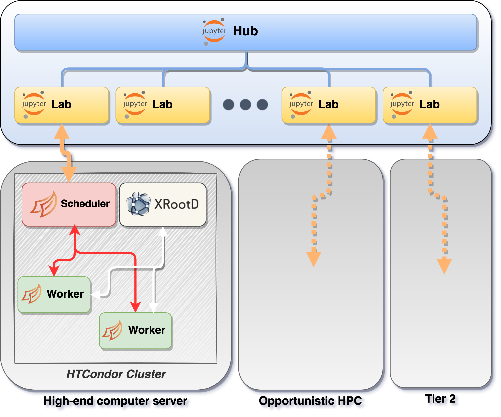

# Architecture and Components

There are few principles that we had in mind while designing the architecture, namely:

- To support the hybrid model: classical batch-like and interactive/quasi interactive
- To be compliant with the emerging analysis frameworks based on modern backends/columnar formulation (Coffea / RDF) without being framework specific
- To foresee a flexible resource integration in order to cope with a model based on a seed of resources for local development and possibility to offload everywhere
- To provide an optimized integration with data
- To offer a democratized solution to anybody in the collaboration
- To adopt open source industry standards, to lower the maintenance costs but also to lower the learning curve to any new adopter

The current design, as depicted in the schema, has a set of services that are manage centrally while the compute-resources can be either locally close to the central services or distributed. In any case, the user is proved with an environment where to perform interactive analysis or just submit jobs to a pool of resources in a cluster.

In detail, the users can access either through the [JupyterHub portal](https://cms-it-hub.cloud.cnaf.infn.it/) where it can have a personal and customizable (a user can provide his own runtime environment)
JupyterLab instance where they can work or via command line as any well known batch system. The latter is implemented with HTCondor which is also responsible to harvest the resources, possibly geographically distributed. Moreover, in order to implement the interactivity, HTcondor is the responsible to allow Dask being distributed where the resources are actually available. [Dask](https://dask.org/) has the role to parallelize the actual user analysis, maximizing the usage of the hardware available in every node (all the cores). The software distribution (ROOT and any other library) is distributed via CVMFS. Finally, the data access is mediated by the [XRootD](https://xrootd.slac.stanford.edu/) service. The caching layer is foreseen in order to optimize the throughput, principally for all the distributed resources.
At the moment there is no permanent storage available and the user is meant to use the grid storage for permanent/long term data archiving.

For what concern the interaction with CMS Data Management system ... HERE DIEGO MUST PUT all what we can get from ESCAPE.

Finally, a key building blocks required for a user in order to be granted access to the system is the authentication (and authorization) that is based on JSON Web Tokens (JWT) issued by the [CMS instance of INDIGO-IAM at CERN](https://cms-auth.web.cern.ch/login). Additional details for accessing the system can be found [here](tutorials/dask_init.md)

All the central service, as well as the seed of local resources for quick development is manage with Kubernetes as detailed below. 

## Components

dettagliare bene cosa fa ogni singolo pezzo qui sotto DIEGO MIRCO

Summarizing all the resources and pieces needed to construct the described architecture,
we have the following components:

- A **[k8s](https://kubernetes.io/) cluster**

    > This cluster manages the JupyterHub service and the relative JupyterLabs of the
    > users

- The **HTCondor central components**

    > namely Collector, Negotiator, CCB and Schedd, run on top of K8s and are responsible
    > to manage any workernode and to dispatch Dask jobs ( master and workernode ).

- A custom derived plugin for **Dask jobqueue** ([repository](https://github.com/comp-dev-cms-ita/dask-remote-jobqueue))

    > This plugin extens the regulare Dask remote jobqueue to support an HTCondor cluster
    > with specific requirements. Also, it enables the Dask scheduler to be launched
    > in the cluster and interact with it.

- A custom **Dask labextension** ([repository](https://github.com/comp-dev-cms-ita/dask-labextension))

    > An update of the official Dask Labextension to support the end-users transparently
    > with the previously mentioned custom Dask remote jobqueue plugin.

- A **forwarder service**

    > Service that allows the Dask component inside the HTCondor Cluster, such as
    > the Dask Scheduler, to be reachable from the JupyterLab instances of the users

- A **controller service**

    > This service manages the interaction between the Dask Labextension in the
    > JupyterLab instance of the user and the Dask Scheduler inside the cluster
