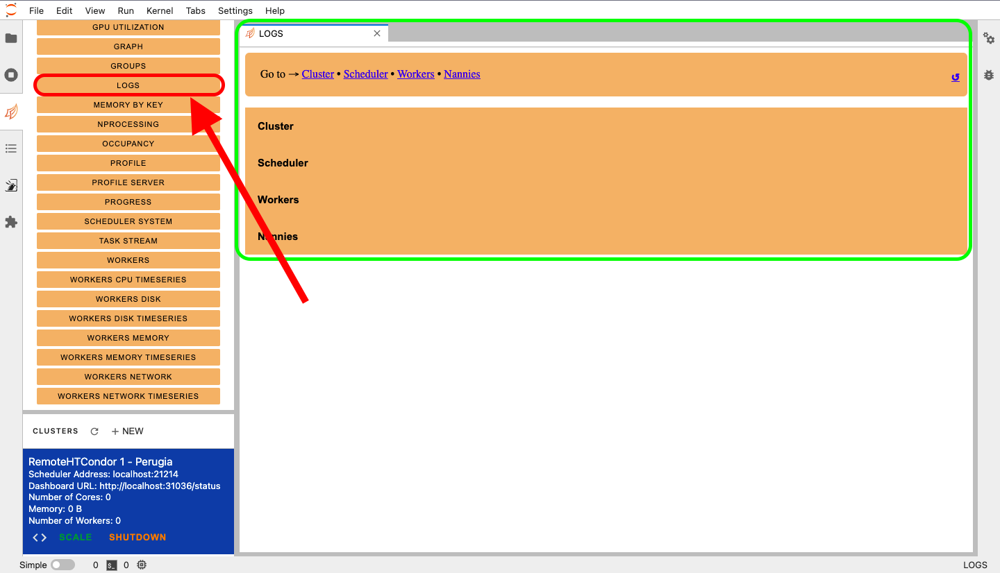
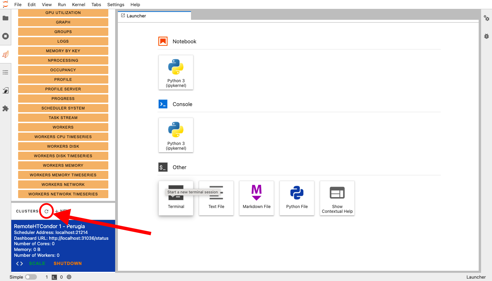

# :handshake: Cluster management
## :material-gauge: Scale

All new clusters will have `0` workers, thus, you need to scale your Dask cluster
to make a calculus. To scale the cluster, you can use the appropriate button:


A dialog screen will be shown. There, you can update the number of workers with
the desired value and then press the `Scale` button.


## :material-notebook-check: Check resources

After a scale, the resource availability of the cluster will be automatically updated.
The information will be available in the cluster list, as shown in the following image:


However, the supply of resources is not instantaneous. As a consequence, you can
check the resources actually attached to the cluster using the `workers` item from
the dashboard list:


A new tab will open, with some information about the current attached workers.
As soon as the workers come up, you will see the list populating with new workers,
with a situation similar to the following (where there are two workers):


## :x: Delete the cluster

To remove the cluster, simply click on the `Shutdown` button. The cluster and its
workers will be deleted automatically.


## :material-view-dashboard: Status from batch system

You can monitor the current job scheduling using the batch system calls. For example,
using HTCondor queue management from a terminal in the JupyterLab:

```bash
condor_q
```

When you start the cluster, you will see a single job launched, that is the Dask
Scheduler coming up. Also, if you scale the cluster manually, you should see a number
of jobs equal to the number of requested workers. This last situation could be
a bit different if you choose the adaptive mode, because only the minimum number of
worker will be launched when you apply the scale, and only when Dask compute something
the scheduler will adapt the number of workers.

Moreover, when you shut down the cluster, all the jobs submitted should pass to the state
completed.

## :material-hand-back-left: Error handling

If you have a problem with the cluster, you can inspect some information to detect
the source of the issue. The first resource available, if you started the cluster
using the Lab Extension, is the `LOGS` item in the dashboard. A new tab will open
like in the following figure (green square):



If the Dask cluster is ok, you can check the Dask Lab Extension logs at the following path:

```bash
# To get the log in realtime
tail -f /var/log/dask_labextension.log 

# Or you can open and inspect them with an editor
vi /var/log/dask_labextension.log
```

However, remember that some problems could be a consequence of a library you used
wrong in the Dask flow, thus, check also how to proper use Dask: [10 minutes to dask](https://docs.dask.org/en/latest/10-minutes-to-dask.html#).

## :material-refresh: Recovery

To get back to work, you can try to `Shutdown` the current cluster and re-create it from zero.
Also, if you still have problem to remove the cluster and restart, use directly the Batch System commands:

```bash
# Example in HTCondor
condor_rm <scheduler_job_id>
# or
condor_rm username
```

After the job deletion, if the cluster is still present in the list, continue to click `Shutdown` to delete
it and update the list with the indicated button:



!!! tip

    if you have issues like `the Dask Lab Extension service is not responding`, consider to restart
    your Jupyter Lab instance.

If you have problem to submit a job with the Batch System, consider to log out to refresh your credentials.
