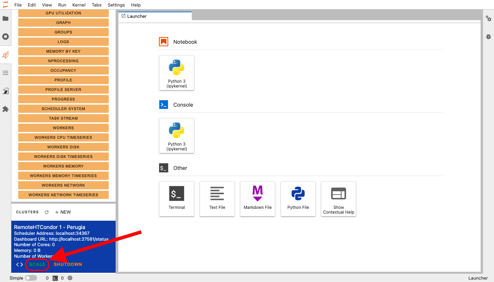
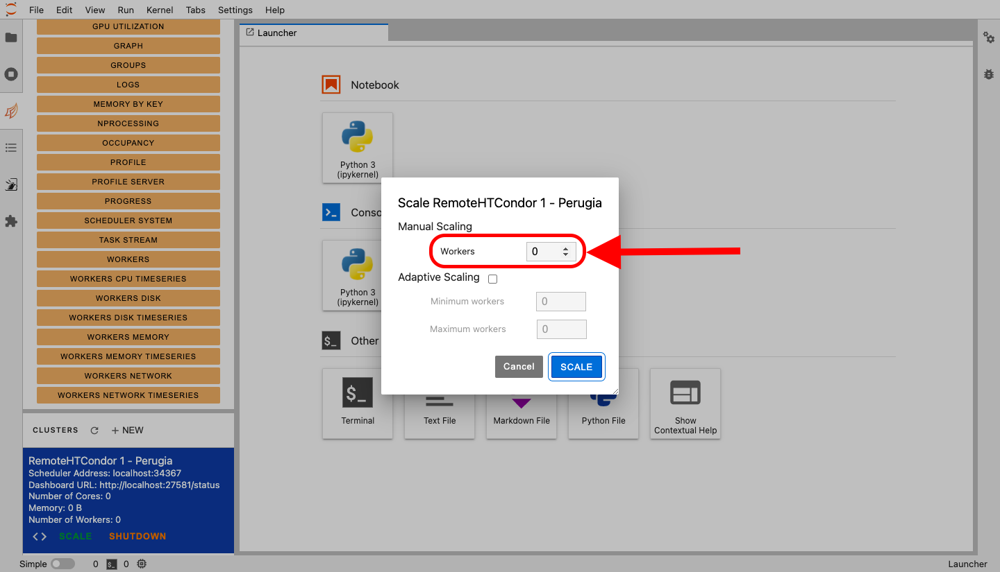
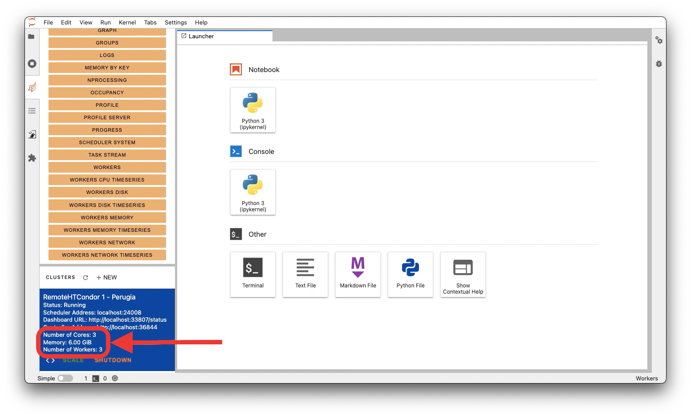
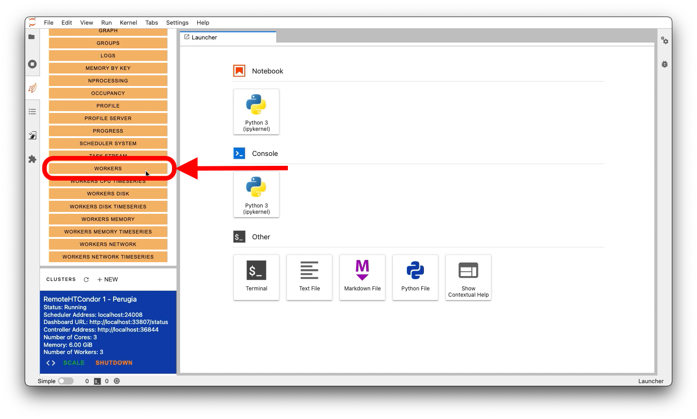
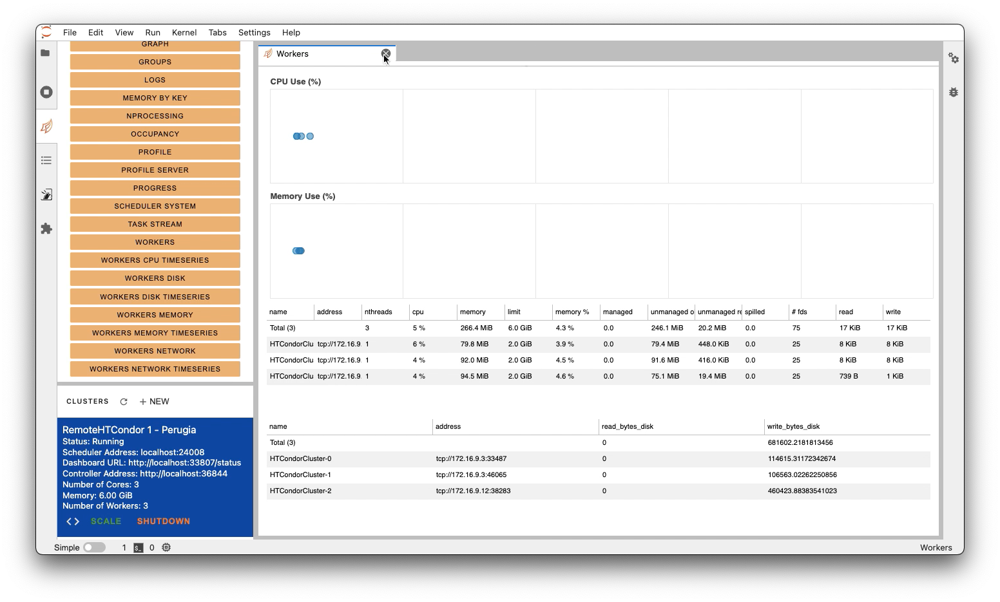
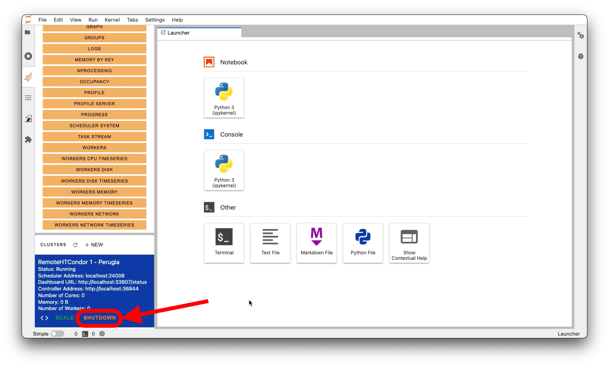

## Scale

All new clusters will have `0` workers, thus, you need to scale your Dask cluster
to make a calculus. To scale the cluster, you can use the appropriate button:

A dialog screen will be shown. There, you can update the number of workers with
the desired value and then press the `Scale` button.

## Check resources

After a scale, the resource availability of the cluster will be automatically updated.
The information will be available in the cluster list, as shown in the following image:

However, the supply of resources is not instantaneous. As a consequence, you can
check the resources actually attached to the cluster using the `workers` item from
the dashboard list:

A new tab will open, with some information about the current attached workers.
As soon as the workers come up, you will see the list populating with new workers,
with a situation similar to the following (where there are two workers):

## Delete the cluster

To remove the cluster, simply click on the `Shutdown` button. The cluster and its
workers will be deleted automatically.

