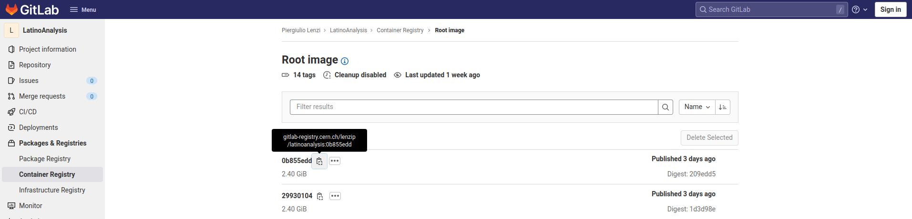
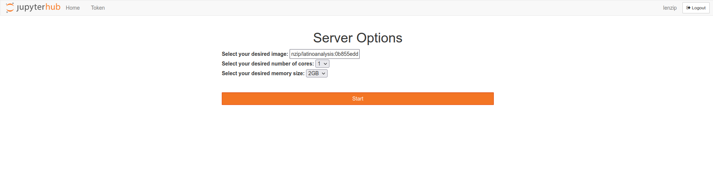

<!--
 Copyright 2021 dciangot
 
 Licensed under the Apache License, Version 2.0 (the "License");
 you may not use this file except in compliance with the License.
 You may obtain a copy of the License at
 
     http://www.apache.org/licenses/LICENSE-2.0
 
 Unless required by applicable law or agreed to in writing, software
 distributed under the License is distributed on an "AS IS" BASIS,
 WITHOUT WARRANTIES OR CONDITIONS OF ANY KIND, either express or implied.
 See the License for the specific language governing permissions and
 limitations under the License.
-->
# Using the images you have built on the jupyter-lab and on the worker nodes


## On the Hub
!!! Fixme 
    Instructions for the JupyterHub [test instance](https://jhub-testbed.131.154.96.124.myip.cloud.infn.it/)

From the [```gitlab.cern.ch``` container registry](https://gitlab.cern.ch/lenzip/LatinoAnalysis/container_registry/) copy the path of the relevant image.



Paste it in the Jupyter Hub startup page and wait for the server to start.




## Job submission script (an example)

Please find here a complete submission script that was succesfully used on the testbed, based on the Latinos framework discussed earlier.
```
executable = /shared-home/plenzi/jobs//mkShapes__ggH2018_v7_11_11__ALL/qqH_hww.1/mkShapes__ggH2018_v7_11_11__ALL__qqH_hww.1.sh
universe = vanilla
output = /shared-home/plenzi/jobs//mkShapes__ggH2018_v7_11_11__ALL/qqH_hww.1/mkShapes__ggH2018_v7_11_11__ALL__qqH_hww.1.out
error = /shared-home/plenzi/jobs//mkShapes__ggH2018_v7_11_11__ALL/qqH_hww.1/mkShapes__ggH2018_v7_11_11__ALL__qqH_hww.1.err
log = /shared-home/plenzi/jobs//mkShapes__ggH2018_v7_11_11__ALL/qqH_hww.1/mkShapes__ggH2018_v7_11_11__ALL__qqH_hww.1.log
request_cpus = 1
+SingularityImage = "/cvmfs/unpacked.cern.ch/gitlab-registry.cern.ch/lenzip/latinoanalysis:0b855edd/"
Requirements   = (SiteName == "T3_IT_Perugia-test")
queue
```
Note that:

   * the output and input files are on ```/shared-home```.
   * the singularity image that is loaded is the same one we used to start the server, except it is taken from ```/cvmfs```, instear of the ```github.cern.ch``` container registry directly.


The exectutable script looks like this:

```
#!/bin/bash
export VO_CMS_SW_DIR=/cvmfs/cms.cern.ch
export X509_USER_PROXY=/shared-home/plenzi/.proxy
#voms-proxy-info
export SCRAM_ARCH=slc7_amd64_gcc900
export VO_CMS_SW_DIR=/cvmfs/cms.cern.ch
source $VO_CMS_SW_DIR/cmsset_default.sh
cd /opt/CMSSW_11_2_5
eval `scramv1 ru -sh`
ulimit -c 0 -s unlimited
cd -
set -e
python /shared-home/plenzi/jobs//mkShapes__ggH2018_v7_11_11__ALL/qqH_hww.1/mkShapes__ggH2018_v7_11_11__ALL__qqH_hww.1.py
[ $? -eq 0 ] && mv /shared-home/plenzi/jobs//mkShapes__ggH2018_v7_11_11__ALL/qqH_hww.1/mkShapes__ggH2018_v7_11_11__ALL__qqH_hww.1.jid /shared-home/plenzi/jobs//mkShapes__ggH2018_v7_11_11__ALL/qqH_hww.1/mkShapes__ggH2018_v7_11_11__ALL__qqH_hww.1.done
```

Note that:

   * The job points to the voms proxy in the ```/shared-home```
   * Since the job lands in a ```singularity``` shell based on the ```docker``` image we have created, it does ```cd /opt/CMSSW_11_2_5``` and then ```cmsenv``` to source the environment.

## Output retrieval

Since the ```/shared-home``` is mounted read-only on the worker node you cannot use it to output files. Options are:
   
   * Stage-out on a SE with ```xrdcp```
   * use ```condor_trasfer_data```, which will return all files that have been created in the working directory.
