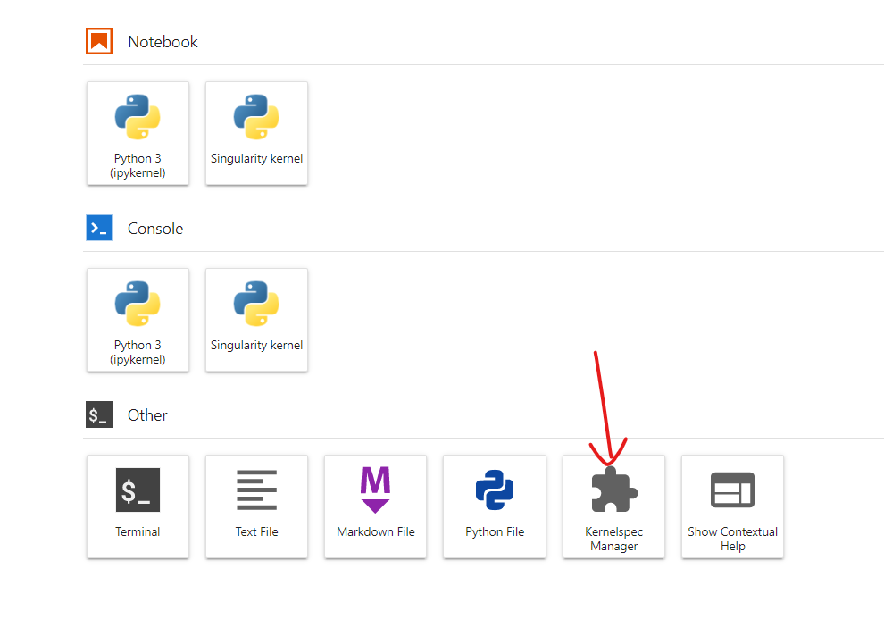
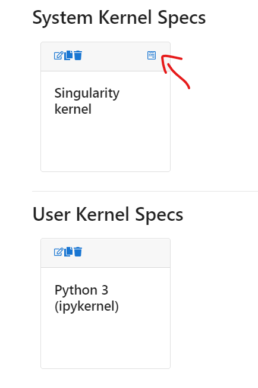
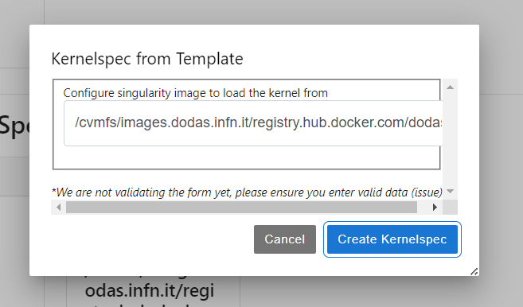

# Creating an image with your code

Here you will lear how to leverage your own image (libraries, code etc) to execute batch and interactive analyses.

## Example: Latinos framework

This section describes the creation of a ```docker``` image with Latinos software as an example to bring **your own image into the facility workflows**. Latinos is a software stack to allow analysis of CMS data in final states with at least one lepton. It is a legacy framework, based on "traditional ROOT". The code resides [here](https://github.com/latinos/LatinoAnalysis). What is described in the following is just one way of achieving the goal of building the image, probably one of the most straightforward and best documented. It is entirely based on the instructions [here](https://awesome-workshop.github.io/docker-cms/03-cvmfs_containers/index.html).

### Requirements

The only requirement is that the image has to be derived from  ```dciangot/jlab-rclone:v7```.

### Placing the software on gitlab to use CI/CD pipelines
A CI/CD (Continuous Integration/Continuous Deployment) pipeline is a ```gitlab``` funtionality which allows defining a set of steps that need to be run following a commit or a merge request. We will use it to create the relevant ```docker``` image.
As a first step the Latinos repository was cloned on [```gitlab.cern.ch```](https://gitlab.cern.ch/lenzip/LatinoAnalysis), to be able to use CI/CD pipelines. A few additions were necessary:

   * a [```.gitlab-ci.yml```](https://gitlab.cern.ch/lenzip/LatinoAnalysis/-/blob/master/.gitlab-ci.yml) file instructing the creation of a pipeline to build the software. In essence, on every new commit, gitlab runs the pipeline, which, if succesful, results in the creation of a ```docker``` image of the latinos software stack. One of the most relevant lines of the pipeline configuration is the specification of the starting image, i.e. the one on top of which the software is built. In this case it was the already mentioned ```dciangot/jlab-rclone:v7```, so that the resulting image has the same functionalities of the original image, especially the capability to handle the Analysis Facility HTCondor cluster.
   * a [```.gitlab/SetupDocker.sh```](https://gitlab.cern.ch/lenzip/LatinoAnalysis/-/blob/master/.gitlab/SetupDocker.sh) holding the instructions to build the software. In this case the software is built in a ```CMSSW_11_2_5``` developer area inside ```/opt```. The job on the worker node will need to ```cd /opt/CMSSW_11_2_5``` and issue ```cmsenv```.

After every commit the pipeline is triggered and the ```docker``` image ends up [here](https://gitlab.cern.ch/lenzip/LatinoAnalysis/container_registry).

### Propagating the image to /cvmfs

Adding the images to ```/cvmfs``` is easy, using ```unpacked.cern.ch```, following instructions [here](https://awesome-workshop.github.io/docker-cms/06-unpacked/index.html), which ultimately boil down to make a merge request like [this one](https://gitlab.cern.ch/unpacked/sync/-/merge_requests/135).
Every night the images are propagated.

You will eventually be able to find your image in `/cvmfs/unpacked.cern.ch/` path.

__N.B.__ For testing purpose we can provide you with a dedicated repository in case you find any trouble with `unpacked` one.

## Using your own image in the Analysis Facility services

### Using your image for HTCondor jobs

You can find an example on how to use your image within HTCondor jobs in this [tutorial](./htcondor/htc_job.md)

### Using your image from terminal

You can then use singularity CLI to load a session on your image stored on cvmfs. The command would look like:

```bash
singularity run /cvmfs/unpacked.cern.ch/MYIMAGEPATH bash 
```

__N.B.__ please look at the singularity documentation for details on all the available options

### Loading a notebook kernel for your interactive analysis

- First of all, open the kernel editor plugin



- Edit the singularity kernel clicking on the edit icon



- When prompted, indicate the path to your image and click on save



- If everything went well, you can now see a new icon appearing in the lauch menu
  


You are now ready to use that kernel for your analysis.

### Using the image on DASK worker nodes

You can find an example on how to use your image for the DASK worker nodes in this [tutorial](./dask/dask_init.md)